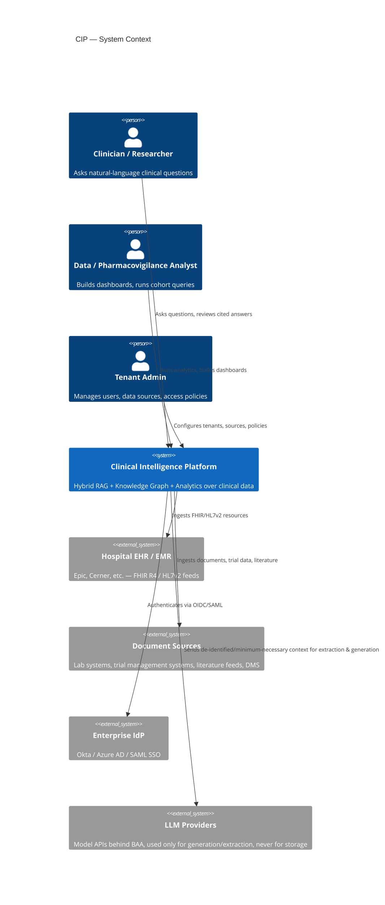

# System Architecture Overview

**Status:** Phase 0 — Design only, no implementation
**Audience:** Engineering leadership, platform architects, security/compliance reviewers
**Revised after Phase 0 review:** see [phase-0-architecture-review.md](../design/phase-0-architecture-review.md) findings A1–A18.

## 1. What this platform is

The Clinical Intelligence Platform (CIP) is a multi-tenant, enterprise-grade system that lets
hospitals, pharmaceutical companies, and healthcare analytics organizations ask questions of —
and run analytics over — their clinical and scientific document corpora (EHR exports, clinical
notes, lab reports, trial protocols, adverse-event reports, literature, guidelines) with
grounded, cited, auditable answers.

It combines three retrieval modalities behind one orchestration layer:

1. **Structured retrieval** over a relational store (FHIR-shaped clinical facts, tenant/RBAC metadata)
2. **Semantic retrieval** over a hybrid vector + keyword index (unstructured clinical text, literature)
3. **Graph retrieval** over a clinical knowledge graph (entities, relationships, ontology-linked concepts, multi-hop reasoning)

A conversational AI layer and an analytics/BI layer sit on top of the same retrieval substrate,
so a clinician's chat question and an analyst's dashboard metric are answered from the same
governed, access-controlled source of truth.

See [ADR-0001](../design/adr-0001-hybrid-graph-vector-retrieval.md) for why all three modalities
are needed rather than vector-only RAG, and [06-security-compliance.md](06-security-compliance.md)
for the access-control model referenced throughout this document.

## 2. Design principles

| Principle | Implication |
|---|---|
| Retrieval access control is enforced at the data layer, not the UI | Every retrieval query (vector, graph, SQL) carries tenant + RBAC scope and is filtered server-side before results reach an LLM context window |
| Every answer is grounded and citable | No conversational response ships without source chunk/entity references; ungrounded generation is rejected by a post-generation citation checker |
| Structured facts and unstructured text are dual-written, never duplicated as source of truth | FHIR-normalized facts live once in Postgres/graph; documents live once in object storage + vector index; both reference a shared `document_id`/`entity_id` |
| Event-driven ingestion, synchronous query path | Ingestion/embedding/graph-build is async and replayable (Kafka); chat and search are synchronous, latency-budgeted APIs |
| Compliance is a first-class architectural input, not a later audit pass | PHI de-identification, audit logging, and BAA-covered infrastructure are chosen at the component-selection stage — see [06-security-compliance.md](06-security-compliance.md) |
| Tenant isolation is defense-in-depth **at the storage layer** | Schema/DB-level isolation in Postgres, namespace/tenant isolation in the vector store, database-per-tenant or property-scoped isolation in the graph store — never isolation by application logic alone. This does **not** extend to every consumer of the Retrieval Service — see the trusted-computing-base note below. |

**Trusted-computing-base note** (added per
[review finding A8](../design/phase-0-architecture-review.md)): storage-layer defense-in-depth
means no single store-level filter gap causes a leak. It does **not** mean every service is
independently defended — the Conversational AI and Analytics services have no data access path of
their own and rely entirely on the Retrieval & Orchestration Service to have already applied
tenant/RBAC filtering (see [04-conversational-ai.md §1](04-conversational-ai.md#1-purpose)). From
those consumers' perspective, **Retrieval Service is the trusted computing base**: a defect in its
context-threading middleware is a single failure mode that defeats every downstream consumer
simultaneously, which is weaker than "defense-in-depth" sounds if read as applying uniformly
end-to-end. This is accepted as the design (rearchitecting every consumer to duplicate Retrieval's
scope-checking would reintroduce the "one missed filter clause" risk ADR-0003 exists to avoid,
just in more places) but is stated explicitly so Retrieval Service is threat-modeled and
security-reviewed with the scrutiny a trusted-computing-base component warrants — not treated as
an equal peer to every other service.

## 3. Context diagram (C4 Level 1)

## 4. Container diagram (C4 Level 2)

```mermaid
C4Container
title CIP — Container Diagram

Person(user, "Clinician / Analyst / Admin")

System_Boundary(cip, "Clinical Intelligence Platform") {
  Container(web, "Web Application", "React, TypeScript", "Chat UI, search, analytics dashboards, admin console")
  Container(gateway, "API Gateway", "Kong / Envoy", "AuthN/Z, rate limiting, request routing, audit logging entry point")
  Container(ident, "Identity & Access Service", "OIDC/SAML, RBAC/ABAC engine", "Tenants, users, roles, scoped policies")
  Container(ingest, "Ingestion Service", "Format detection, OCR, HL7v2/FHIR/DICOM parsing", "Normalizes inbound data, emits ingestion events")
  Container(extract, "Extraction & Coding Service", "NLP entity/relation extraction, SNOMED/ICD/RxNorm/LOINC coding", "Structures unstructured text, resolves ontology concepts")
  Container(embed, "Embedding Service", "Chunking + vector generation, model-versioned", "Produces embeddings for hybrid index")
  Container(graphsvc, "Knowledge Graph Service", "Entity/relationship graph builder", "Builds & maintains clinical KG, community summaries")
  Container(retrieval, "Retrieval & Orchestration Service", "Hybrid fusion, reranking, query routing", "Single retrieval API fronting vector + keyword + graph + SQL")
  Container(chat, "Conversational AI Service", "LLM gateway, session state, grounding/citation enforcement", "Serves chat/Q&A")
  Container(analytics, "Analytics & BI Service", "Aggregation, cohort queries, dashboard API", "Serves dashboards and reports")
  Container(audit, "Audit & Compliance Service", "Immutable audit log, access reports", "45 CFR 164.312(b) audit trail")

  ContainerDb(pg, "Operational Store", "PostgreSQL + pgvector", "Tenants, users, FHIR-shaped clinical facts, document metadata, embeddings metadata")
  ContainerDb(graphdb, "Graph Store", "Neo4j", "Clinical knowledge graph, ontology nodes, community summaries")
  ContainerDb(search, "Search Index", "OpenSearch", "BM25/keyword index, hybrid fusion partner to pgvector")
  ContainerDb(olap, "Analytics Warehouse", "BigQuery / Synapse / Redshift", "De-identified aggregates for BI")
  ContainerDb(object, "Object Storage", "S3 / GCS / Azure Blob", "Raw documents, images, DICOM studies")
  ContainerQueue(bus, "Event Bus", "Kafka", "Ingestion → extraction → embedding → graph-build pipeline")
}

System_Ext(llm, "LLM Provider API")
System_Ext(idp_ext, "Enterprise IdP")

Rel(user, web, "HTTPS")
Rel(web, gateway, "HTTPS/REST")
Rel(gateway, ident, "Validates session, scope")
Rel(ident, idp_ext, "OIDC/SAML")
Rel(gateway, chat, "Chat requests")
Rel(gateway, analytics, "Dashboard/report requests")
Rel(gateway, ingest, "Admin-triggered/API ingestion")
Rel(ingest, bus, "Publishes raw-document events")
Rel(bus, extract, "Consumes")
Rel(extract, bus, "Publishes structured-entity events")
Rel(bus, embed, "Consumes")
Rel(bus, graphsvc, "Consumes")
Rel(extract, pg, "Writes normalized clinical facts")
Rel(embed, pg, "Writes vector embeddings (pgvector)")
Rel(embed, search, "Writes keyword index")
Rel(graphsvc, graphdb, "Writes entities/relationships/communities")
Rel(ingest, object, "Writes raw documents")
Rel(retrieval, pg, "Vector + SQL queries")
Rel(retrieval, search, "Keyword queries")
Rel(retrieval, graphdb, "Graph traversal queries")
Rel(chat, retrieval, "Retrieves grounded context")
Rel(chat, llm, "Generation (context-scoped, BAA-covered)")
Rel(analytics, olap, "Aggregate queries")
Rel(pg, olap, "Periodic de-identified ETL")
Rel(gateway, audit, "Every request logged")
Rel(chat, audit, "Every retrieval + generation logged with citations")
```

## 5. Service inventory

| Service | Responsibility | Talks to |
|---|---|---|
| API Gateway | AuthN/Z enforcement, rate limiting, tenant routing, request/response audit hook | All external traffic |
| Identity & Access Service | Tenant, user, role, and scoped-policy management; issues short-lived scoped tokens | Enterprise IdP, all services (token introspection) |
| Ingestion Service | Detects format (PDF/scan/HL7v2/FHIR/DICOM), OCRs, normalizes, emits events | Object storage, Event Bus |
| Extraction & Coding Service | NLP entity/relation extraction, ontology coding (SNOMED/ICD/LOINC/RxNorm via UMLS) | Event Bus, Operational Store |
| Embedding Service | Chunking strategy, embedding generation, model version tracking | Event Bus, Operational Store, Search Index |
| Knowledge Graph Service | Builds/updates clinical KG, entity resolution, Leiden community detection, community summarization | Event Bus, Graph Store |
| Retrieval & Orchestration Service | Hybrid fusion (RRF) across vector/keyword/graph/SQL, reranking, query routing (local vs. global vs. structured) | Operational Store, Search Index, Graph Store |
| Conversational AI Service | Session management, prompt assembly, LLM calls, citation/grounding enforcement, guardrails | Retrieval Service, LLM Provider, Audit Service |
| Analytics & BI Service | Cohort queries, aggregate metrics, scheduled reports, dashboard API | Analytics Warehouse, Operational Store |
| Audit & Compliance Service | Immutable audit log, access reports, de-identification job orchestration | All services (write path), Operational Store |

## 6. Cross-cutting concerns

- **Multi-tenancy** — see [06-security-compliance.md §2](06-security-compliance.md#2-multi-tenancy-model)
- **Data flow (ingestion → query)** — see [02-rag-hybrid-retrieval.md §1](02-rag-hybrid-retrieval.md#1-ingestion--indexing-pipeline)
- **Knowledge graph construction** — see [03-knowledge-graph.md](03-knowledge-graph.md)
- **Deployment topology** — see [../deployment/deployment-architecture.md](../deployment/deployment-architecture.md)
- **Scale ceilings, capacity numbers, and consolidated NFRs** — see [../nfr.md](../nfr.md), added
  after the Phase 0 review found latency/throughput/scale targets scattered piecemeal across
  documents with no single reference ([review finding A14/A15](../design/phase-0-architecture-review.md))
- **SLA, disaster recovery, incident response, cost model** — see [../operations/sla-dr.md](../operations/sla-dr.md),
  previously entirely absent ([review finding A1](../design/phase-0-architecture-review.md))

## 7. Related documents

- [ADR-0001: Hybrid graph + vector retrieval over vector-only RAG](../design/adr-0001-hybrid-graph-vector-retrieval.md)
- [ADR-0002: Neo4j as the graph store](../design/adr-0002-graph-database-choice.md)
- [ADR-0003: Postgres multi-tenancy model](../design/adr-0003-multi-tenancy-model.md)
- [ADR-0004: Storage engine evaluation (Postgres+OpenSearch vs. unified MongoDB Atlas)](../design/adr-0004-storage-engine-evaluation.md)
- [RAG & Hybrid Retrieval Design](02-rag-hybrid-retrieval.md)
- [Knowledge Graph Design](03-knowledge-graph.md)
- [Conversational AI Design](04-conversational-ai.md)
- [Analytics Dashboard Design](05-analytics-dashboard.md)
- [Security, Multi-Tenancy & Compliance](06-security-compliance.md)
- [Glossary](../glossary.md) · [Non-Functional Requirements](../nfr.md)
- [Phase 0 Architecture Review](../design/phase-0-architecture-review.md)
