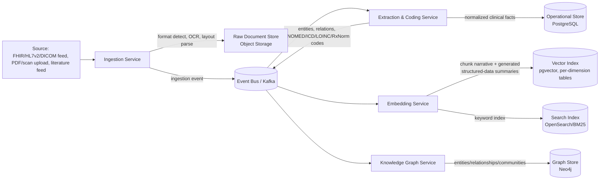
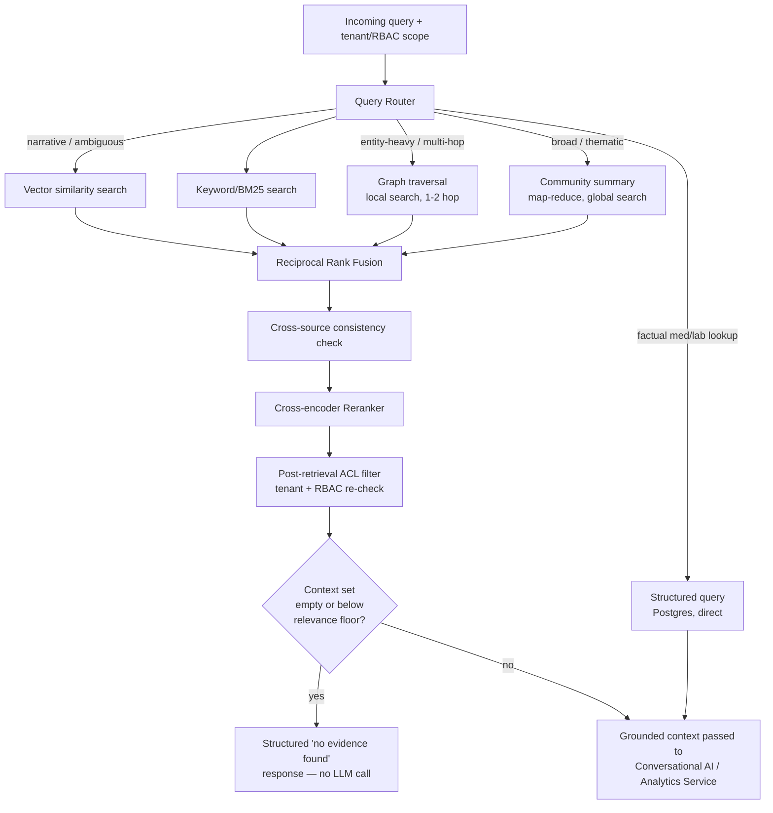

# RAG & Hybrid Retrieval Design

**Status:** Phase 2 — retrieval path implemented; generation path still design-only
**Depends on:** [01-system-architecture.md](01-system-architecture.md), [ADR-0001](../design/adr-0001-hybrid-graph-vector-retrieval.md)
**Revised after Phase 0 review:** see [phase-0-architecture-review.md](../design/phase-0-architecture-review.md) findings B1–B17.

**Where this document and the implementation differ.** Routing, retrieval, fusion, reranking,
context assembly, and the no-evidence gate are implemented in
[services/retrieval](../../services/retrieval/README.md). Three deviations are deliberate and
recorded in the [Phase 2 engineering report](../design/phase-2-engineering-report.md):
the vector tier is MongoDB Atlas rather than pgvector ([ADR-0007](../design/adr-0007-vector-store-mongodb-atlas.md));
the embedding model is a deterministic lexical baseline, not a clinical model; and the
reranker is an interpretable linear feature scorer, not the cross-encoder specified in §2.3.
The BM25 tier is currently in-process rather than OpenSearch. Everything below describes the
target design; the report describes what exists.

## 1. Ingestion & indexing pipeline

All four downstream consumers (Operational Store, Vector Index, Search Index, Graph Store) read
from the same ingestion event stream, so the corpus is never indexed by four independent,
potentially-drifting pipelines — this is the mitigation documented in
[ADR-0001](../design/adr-0001-hybrid-graph-vector-retrieval.md). See
[ADR-0004](../design/adr-0004-storage-engine-evaluation.md) for why this stays a 3-store split
(Postgres + pgvector + OpenSearch) rather than a unified document store.

### 1.1 Document classification & layout-aware parsing

Inbound documents are classified before extraction (discharge summary, lab report, radiology
note, trial protocol, adverse-event report, literature abstract, HL7v2 message, FHIR bundle,
DICOM study). Layout-aware parsing (not flat OCR-to-text) preserves table and form structure —
critical because lab values, medication tables, and structured trial data lose clinical meaning
if flattened to plain text before extraction.

**HL7v2 and FHIR resources do not go through chunk-embedding at all.** They are structured,
non-narrative data; the Extraction & Coding Service parses them directly into normalized rows in
`conditions`/`medications`/`observations` and corresponding graph nodes/edges
([03-knowledge-graph.md](03-knowledge-graph.md)). Only the human-readable narrative portions of a
document (or an LLM-generated narrative summary of structured data — see §1.2) are ever chunked
and embedded. This split is a hard rule enforced by `document_type`, not left to per-engineer
interpretation — see the `document_type` CHECK constraint in
[postgres-schema.sql](../database/postgres-schema.sql).

### 1.2 Chunking strategy

**Algorithm** (not just a label — resolves [review finding B7](../design/phase-0-architecture-review.md)):
narrative text is split using embedding-similarity breakpoint detection — compute sentence-level
embeddings, then cut a chunk boundary wherever cosine distance between consecutive sentence
embeddings exceeds a tuned percentile threshold (a standard semantic-chunking method, e.g. as
implemented by LlamaIndex's `SemanticSplitterNodeParser` or an equivalent in-house
implementation) — rather than fixed token windows. Clinical-note-specific rules apply on top:

> **Implementation status.** This algorithm requires embeddings, which are Phase 2 scope.
> Phase 1 ships `StructuralSemanticChunker`, which uses the document's own section, table,
> paragraph, and sentence boundaries as its semantic signal, behind a `Chunker` protocol
> that this algorithm implements in Phase 2. The rules below hold for both implementations
> and are enforced by tests. Rationale and the invariants both chunkers must satisfy:
> [ADR-0006](../design/adr-0006-phase1-chunking-strategy.md).

- Each chunk retains a metadata header: `document_id`, `tenant_id`, `patient_id` (if applicable),
  `encounter_id`, `source_system`, `document_type`, `effective_date`, `access_scope`.
- Chunk size target: 256–512 tokens, with a 10–15% overlap window.

**Structured data (medication lists, lab panels, problem lists) is never flattened into an
embedded chunk.** Flattening a table into text and embedding it is known to degrade dense-model
performance — row/column relationships collapse into token soup, and the same data already exists
in normalized form (`medications`, `observations` tables — see
[postgres-schema.sql](../database/postgres-schema.sql)). Instead:

1. The structured facts are written directly to the relational store and graph, as in §1.1.
2. A short, LLM-generated narrative summary of that structured section (e.g., "Patient is on
   Lisinopril 10mg daily, Metformin 500mg twice daily...") is generated and embedded as a single
   `document_chunks` row with `section_type = 'generated_medication_summary'` (or
   `'generated_lab_summary'`), giving the vector index a semantically searchable entry point
   *without* being the system of record for the underlying values.
3. Retrieval for factual medication/lab questions queries the structured tables directly (via the
   Retrieval Service's structured-query path, §2.1) rather than relying on the generated-summary
   chunk for anything beyond narrative recall/context — the generated summary is retrieval
   scaffolding, not a source of truth, and is never cited as one (see
   [04-conversational-ai.md §3](04-conversational-ai.md#3-grounding--citation-enforcement)).

### 1.3 Embedding model

A model-agnostic embedding interface, versioned per [postgres-schema.sql](../database/postgres-schema.sql)
`embedding_models` table, with one dedicated embedding-storage table per supported dimensionality
(`chunk_embeddings_1024`, `_1536`, `_3072`) — pgvector requires a fixed-width column, so
"model-agnostic" is implemented as *which table a model writes to*, not a single column that
silently can't hold every model's output (this inconsistency was flagged in
[review finding B2](../design/phase-0-architecture-review.md) and fixed in the schema). Phase 1
default: a top-tier general-purpose embedding model selected at implementation time via a bake-off
against the clinical-retrieval eval set (§4); candidates to evaluate include current-generation
models such as Voyage, OpenAI, and Cohere embedding families, plus an open-weight fallback for
on-prem/air-gapped hospital deployments where no external embedding API call is permitted.

**BAA coverage explicitly includes embedding calls, not just generation/extraction** — see
[06-security-compliance.md §6](06-security-compliance.md#6-llm-vendor-governance), corrected per
[review finding B1](../design/phase-0-architecture-review.md): sending raw clinical chunk text to
a third-party embedding API is a PHI disclosure to a subprocessor like any other, and is gated by
the same BAA/allowlist requirement as generation calls, not exempted because it isn't literally
"generation."

**Re-embedding on model migration:** when a new default embedding model is adopted, existing
chunks are not silently left on the old model. A backfill job re-embeds all `document_chunks` rows
into the new model's `chunk_embeddings_<dims>` table; until backfill completes for a given tenant,
retrieval queries **both** the outgoing and incoming model's tables for that tenant and fuses
results, rather than switching atomically (which would create a retrieval blackout for
not-yet-re-embedded content). The outgoing model's `embedding_models.retired_at` is set only after
backfill confirms 100% coverage.

### 1.4 Entity/relation extraction & ontology coding

The Extraction & Coding Service resolves free-text clinical mentions to standard ontology
concepts before they enter the graph, using UMLS as the reconciliation layer:

- Conditions/findings/procedures → **SNOMED CT**, cross-mapped to **ICD-10/11** for billing/reporting views
- Lab/observation names → **LOINC**
- Medications → **RxNorm** (cross-linked to ATC/NDC for pharma use cases)
- Rare-disease phenotypes → **HPO**
- All of the above reconciled via **UMLS CUI** as the canonical identity key, preventing duplicate
  entity proliferation when the same concept arrives from multiple source vocabularies

Entities that **fail** to resolve to any ontology concept are not dropped — they are written as
`LocalConcept` nodes with an unmapped review status; see
[03-knowledge-graph.md §1](03-knowledge-graph.md#1-graph-construction-pipeline-graphrag-pattern).
Ontology licensing (SNOMED CT/UMLS are not unrestricted-use) is tracked as a procurement
dependency in [docs/legal/ontology-licensing.md](../legal/ontology-licensing.md), not assumed free.

> **Implementation status.** Phase 1 ships document-level extraction — section detection,
> metadata, PHI-category indicators — but **not** ontology concept coding, which is blocked on
> the licensed terminology data above. See
> [ADR-0005](../design/adr-0005-phase1-service-decomposition.md).

This structured output feeds both the Operational Store (normalized clinical facts) and the
Knowledge Graph Service (entity/relationship graph) — see [03-knowledge-graph.md](03-knowledge-graph.md).

## 2. Query-time retrieval

Retrieval paths (graph, vector, keyword, structured) are **fanned out concurrently**, not run
sequentially — the latency budget in §5 is only achievable if the router dispatches all applicable
paths in parallel and fuses on completion, which this diagram and the budget table now state
explicitly (previously unstated — [review finding B17](../design/phase-0-architecture-review.md)).

### 2.1 Query routing

The router classifies each incoming query into one or more of a fixed intent set — not an
open-ended classification, so it's buildable: `patient_factual_lookup` (dosage/lab-value
questions — routes to structured query, §1.2), `entity_relationship` (contraindication/treatment
questions — routes to graph local search), `thematic_corpus_wide` (routes to graph global
search, only if the tenant has `deep_analytics_enabled` — see
[03-knowledge-graph.md §5](03-knowledge-graph.md#5-community-summarization-opt-in-trigger--sla)),
and `narrative_open` (routes to vector + keyword). Classification is rule-based (regex/keyword
patterns) for the majority of clinical query shapes, which are a bounded set in practice
(dosage questions, contraindication questions, "what happened at visit X" questions); an
LLM-based classifier handles the residual open-text case. **Below a confidence threshold, the
router does not guess narrowly — it dispatches the broader default bundle** (vector + keyword +
graph local search) rather than picking one path incorrectly, trading some latency for recall on
ambiguous queries. Routing decisions are logged per-query (which intent was assigned, confidence
score, which paths were dispatched) as part of the tracing requirement in §4, both to support
debugging and to feed the eval set's query-routing accuracy metric.

### 2.2 Fusion, cross-source consistency, and reranking

- **Reciprocal Rank Fusion (RRF)** combines ranked lists from vector, keyword, and graph-derived
  candidates into one ranked list — the standard, well-benchmarked fusion technique. RRF fuses
  *rank*, not *truth*: it says nothing about what happens when two sources disagree.
- **Cross-source consistency check** (new — [review finding B6](../design/phase-0-architecture-review.md)):
  before reranking, fused results are scanned for direct factual contradiction between sources
  (e.g., a graph edge asserting a contraindication that no retrieved vector/keyword chunk
  mentions, or a stale graph fact contradicted by a more recent document). Contradictions are not
  silently passed through — the more recent/higher-evidence-level source (per the conflict
  policy in [graph-schema.md §3](../database/graph-schema.md#3-entity-resolution--conflict-handling))
  is retained and the superseded one is either dropped from context or explicitly flagged as
  superseded to the generation step, so the model isn't handed two contradictory "facts" with no
  signal about which one to trust.
- A **cross-encoder reranker** re-scores the fused top-N against the actual query — mandatory in
  the production pipeline. Candidate set is bounded to top-50 pre-rerank / top-10 post-rerank to
  keep the latency budget in §5 realistic; the reranker is self-hosted (not a third-party API
  call) specifically to avoid re-opening the PHI/BAA question from §1.3 for every single
  retrieval query, which would be a materially larger PHI-exposure surface than the one-time
  embedding call.
- **Post-retrieval ACL re-check**: even though every store-level query is pre-filtered by tenant/
  RBAC scope, the fused/reranked result set is re-validated against the requesting actor's scope
  immediately before context assembly — defense-in-depth against a filter gap anywhere upstream
  (see [06-security-compliance.md](06-security-compliance.md)).

### 2.3 Global vs. local graph search

Following the GraphRAG pattern (see [03-knowledge-graph.md](03-knowledge-graph.md)):

- **Local search** — entity-anchored questions ("adverse events for Drug X") walk the immediate
  graph neighborhood, hop-bounded per
  [03-knowledge-graph.md §3](03-knowledge-graph.md#3-local-vs-global-search); cheap, precise, used
  for the majority of clinical point-lookup queries.
- **Global search** — corpus-wide thematic questions ("what are emerging safety signals across
  our Q3 trial reports") run a map-reduce over pre-computed community summaries; more expensive,
  reserved for analytics-style questions and opt-in per tenant (see
  [03-knowledge-graph.md §5](03-knowledge-graph.md#5-community-summarization-opt-in-trigger--sla)
  for the concrete trigger/SLA — no longer an unspecified "opt-in").

### 2.4 No-evidence gate (hallucination prevention, structural)

If the fused, reranked, ACL-filtered context set is **empty or entirely below a minimum relevance
score**, the pipeline does not call the generation LLM at all — it returns a structured
"no evidence found in the available corpus for this question" response. This is a hard pipeline
rule, not a prompt instruction the model can be talked out of: an LLM given no retrieved context
is otherwise free to answer from parametric knowledge, which is the single most common hallucination
failure mode in clinical RAG and is exactly the scenario the grounding checker
([04-conversational-ai.md §3](04-conversational-ai.md#3-grounding--citation-enforcement)) cannot
reliably catch after the fact if there was never any real context to check against
([review finding B3](../design/phase-0-architecture-review.md)).

## 3. Orchestration framework choice

LlamaIndex-style retrieval abstractions (document → node → index → query engine) for the
indexing/retrieval layer, with a LangGraph-style explicit state graph for multi-step agentic
orchestration (query decomposition, tool calls, multi-turn conversation state) in the
Conversational AI Service. As query patterns stabilize post-Phase-1, the platform is expected to
progressively replace generic framework abstractions with purpose-built retrieval code where
framework overhead measurably affects the latency budget (§5) — this is a known industry pattern,
not a Phase-0 commitment either way; the framework choice is a starting point, not a permanent
dependency.

## 4. Evaluation & observability

**Offline eval set** — specified concretely, not just asserted (
[review finding B12](../design/phase-0-architecture-review.md)):

- **Size:** minimum 150 clinical Q&A pairs per tenant vertical (hospital, pharma) at Phase 1
  launch, growing to 500+ per vertical by Phase 2, covering each query intent in §2.1 and each
  document type in §1.1.
- **Ground-truth ownership:** authored and reviewed by a credentialed clinical SME (contracted
  clinical informaticist or equivalent role) per tenant vertical, not by engineering — retrieval
  correctness for clinical content is a domain-expertise judgment, not an engineering one.
- **Cadence:** run on every PR that touches chunking, embedding model selection, reranking, or
  routing logic (blocking CI check), plus a full nightly run against the current production
  configuration to catch drift.
- **Gating thresholds:** faithfulness ≥ 0.9, context precision ≥ 0.8, answer relevancy ≥ 0.85
  (RAGAS-style metrics) — a change that regresses any threshold below its floor fails CI and
  cannot merge; thresholds are revisited quarterly as the eval set grows and baseline performance
  is better understood, not fixed forever at these Phase 1 starting values.
- **Numeric-value accuracy** (new — [review finding B10](../design/phase-0-architecture-review.md)):
  a distinct, deterministic check runs against every eval-set answer containing a lab value or
  dosage — exact-string/regex match of the generated numeric value against the literal retrieved
  source value, separate from the general faithfulness score, because a wrong dosage that is
  merely "similar" is a patient-safety incident, not a partial-credit accuracy miss. This same
  deterministic check runs in production, not just offline eval — see
  [04-conversational-ai.md §3](04-conversational-ai.md#3-grounding--citation-enforcement).

- **Online tracing**: every retrieval call (which paths were dispatched by the router, what was
  returned by each store, what was filtered by ACL, what the reranker scored, what the LLM was
  actually shown) is traced end-to-end and retained per the audit requirements in
  [06-security-compliance.md](06-security-compliance.md).
- **Staleness monitoring**: documents/entities are flagged for re-indexing on source-system
  update; a scheduled freshness audit prevents silent retrieval-quality decay from an
  unmonitored, aging index — a well-documented failure mode in production RAG deployments.

## 5. Latency & cost budget (design targets, to be validated in Phase 1)

Retrieval paths run concurrently (§2), so this budget reflects the slowest path per stage, not a
sum across paths.

| Stage | Target (p95) |
|---|---|
| Query routing | < 20 ms |
| Vector + keyword + structured search (concurrent) | < 80 ms |
| Graph traversal (hop-bounded local search) | < 50 ms |
| Cross-source consistency check | < 20 ms |
| Fusion + rerank (top-50 → top-10, self-hosted reranker) | < 120 ms |
| ACL re-check | < 20 ms |
| **Retrieval total** | **< 320 ms** |
| LLM generation (streamed) | first token < 1.5 s |

Cost controls: tiered model routing (cheaper model for extraction/classification, top-tier model
reserved for final generation), semantic response caching, batch embedding for bulk ingestion.
Per-tenant unit economics (cost per query, per-GB ingested, ontology license amortization) are
tracked in [docs/operations/sla-dr.md §6](../operations/sla-dr.md#6-cost-model) rather than here,
to keep this document scoped to retrieval design rather than pricing.

## 6. Related documents

- [Knowledge Graph Design](03-knowledge-graph.md)
- [Conversational AI Design](04-conversational-ai.md)
- [PostgreSQL schema](../database/postgres-schema.sql)
- [ADR-0004: Storage engine evaluation](../design/adr-0004-storage-engine-evaluation.md)
- [Phase 0 Architecture Review — findings B1-B17](../design/phase-0-architecture-review.md)
