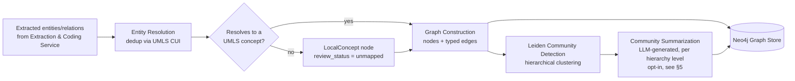

# Knowledge Graph Design

**Status:** Phase 0 — Design only
**Depends on:** [ADR-0002](../design/adr-0002-graph-database-choice.md), [02-rag-hybrid-retrieval.md](02-rag-hybrid-retrieval.md)
**Revised after Phase 0 review:** see [phase-0-architecture-review.md](../design/phase-0-architecture-review.md) findings C1–C21.

## 1. Graph construction pipeline (GraphRAG pattern)



This mirrors Microsoft GraphRAG's pipeline: LLM-assisted entity/relationship extraction (done
upstream by the Extraction & Coding Service, using ontology coding rather than free-form LLM
extraction alone, since clinical entities have authoritative vocabularies — see
[02-rag-hybrid-retrieval.md §1.4](02-rag-hybrid-retrieval.md#14-entityrelation-extraction--ontology-coding)),
entity resolution/dedup, graph construction, **Leiden algorithm** hierarchical community
detection, and per-level community summarization.

Per [ADR-0001](../design/adr-0001-hybrid-graph-vector-retrieval.md), full corpus-wide community
summarization is expensive and is **not** run eagerly for every tenant on ingestion. Phase 1
default: build the entity/relationship graph eagerly (needed for local search on every query);
defer community summarization to a scheduled batch job (nightly) or on-demand for tenants who
opt into "deep analytics" / global-search workloads — a LazyGraphRAG-style deferred-summarization
pattern that cuts indexing cost dramatically versus eager full-GraphRAG summarization. The
concrete opt-in trigger, SLA, and re-clustering cadence are specified in §5–§6.

**Ontology coverage is never assumed to be 100%.** Real clinical text routinely contains local
lab panels, hospital-specific formulary codes, and free-text phrasing that don't resolve to a
UMLS concept. Any entity that fails resolution is still written to the graph — as a
`LocalConcept` node with `review_status = 'unmapped'` — rather than silently dropped. A
terminology-team triage queue (Phase 2 tooling) reviews these and, where a mapping is found,
promotes the node to a real ontology link without losing the original fact or its provenance.
Full node/edge shape: [graph-schema.md §1](../database/graph-schema.md#1-node-labels--properties).

**Entity resolution (UMLS CUI dedup) is not fact conflict resolution.** Resolving two mentions to
the same concept node prevents duplicate *nodes*; it says nothing about what happens when two
sources assert contradictory *facts* about the same patient (e.g., one note says a medication was
discontinued, another says it's active). That is a distinct, explicit policy — see
[graph-schema.md §3](../database/graph-schema.md#3-entity-resolution--conflict-handling):
conflicting assertions are both kept (never overwritten in place), linked via a `SUPERSEDES`
edge, and reconciled by transaction-time precedence with an evidence-level override, so a
point-in-time query can still recover what was believed true as of any given date — the
bi-temporal (`valid_from`/`valid_to`/`asserted_at`) properties on every patient-fact node exist
specifically to make that query answerable.

**Ontologies are added as data, not code.** New/regional terminologies (e.g., OPCS-4 for the UK,
ICD-10-CA) are onboarded via an ontology-registry table (mirroring the `embedding_models`
versioned-registry pattern in [postgres-schema.sql](../database/postgres-schema.sql)) rather than
by touching Extraction, Graph, and Postgres schema code for each new ontology — the registry
entry declares the ontology's node label, its UMLS-CUI-linking edge type, and its source-file
ingestion format; the Extraction & Graph services consume it generically.

## 2. Entity & relationship schema

### 2.1 Core clinical entity types

| Entity | Key ontology link | Notes |
|---|---|---|
| `Patient` | — (internal ID only; never an ontology concept) | Root of patient-instance subgraph |
| `Encounter` | — | Visit/admission; anchors temporal context |
| `Condition` | SNOMED CT concept, cross-mapped ICD-10/11 | Diagnosis/finding |
| `Medication` | RxNorm ingredient/clinical-drug concept | Cross-linked ATC, NDC |
| `Procedure` | SNOMED CT procedure concept | |
| `Observation` / `LabResult` | LOINC code | Numeric/coded result + reference range |
| `AllergyIntolerance` | SNOMED CT | |
| `Device` | SNOMED CT / GUDID | |
| `Provider` | — | Clinician/prescriber |
| `Organization` / `Facility` | — | Site of care |
| `Phenotype` | HPO term | Rare-disease/genomics use cases |
| `ClinicalTrial` | NCT ID | Pharma use case |
| `AdverseEventDefinition` | MedDRA (pharma-specific extension) | Shared reference definition — see note below |
| `Guideline` / `LiteratureSource` | DOI / PMID / internal doc ID | Evidence citation target — shared reference content |
| `LocalConcept` | none (that's the point) | Fallback for entities that don't resolve to any ontology concept — see §1 |

Ontology concept nodes (`SnomedConcept`, `IcdCode`, `LoincCode`, `RxNormConcept`, `HpoTerm`) are
themselves graph nodes, keyed by **UMLS CUI** as the canonical reconciliation identifier — this
is the design decision that prevents duplicate entity proliferation when the same clinical
concept is mentioned across multiple documents/source vocabularies (see
[02-rag-hybrid-retrieval.md §1.4](02-rag-hybrid-retrieval.md#14-entityrelation-extraction--ontology-coding)).
A patient-instance graph (patient-specific facts) sits above this shared ontology graph, with
patient facts resolving to standard concept nodes rather than duplicating free text per patient.

`Guideline`, `AdverseEventDefinition`, and `ClinicalTrial` are modeled as **shared, tenant-agnostic
reference content** (like the ontology layer), not per-tenant instances — a clinical guideline or
a MedDRA adverse-event definition means the same thing for every tenant, and modeling it as
tenant-scoped would either duplicate identical nodes across every tenant or leave it inconsistently
populated. A tenant's patient-specific *occurrence* of an adverse event is still a tenant-scoped
fact, recorded via `MENTIONS`/`HAS_OBSERVATION` on the instance layer, pointing back at the shared
definition — the definition and the occurrence are different nodes at different layers.

Ontology reference nodes are **versioned, not mutated in place**: each carries `ontology_release`
and `valid_from`, with a `superseded_by` pointer used instead of overwriting a code's meaning when
a new terminology release ships (SNOMED CT ships biannually). Overwriting a shared node in place
would silently change the meaning of every already-linked patient fact across every tenant the
moment a terminology update landed — versioning avoids that.

### 2.2 Relationship types

Relationships are specific and clinically meaningful — generic `related_to` edges are avoided
because they destroy the multi-hop reasoning value the graph exists to provide. Every clinically
actionable relationship (not just the ones that happened to be modeled first) carries
`{confidence, source_document_id, asserted_by, evidence_level}` — full property definitions in
[graph-schema.md §2](../database/graph-schema.md#2-relationship-types).

Generic clinical/pharmacological knowledge — a drug treating a condition, two drugs being
contraindicated, a drug causing an adverse event — is knowledge about the **ontology concept**,
true for every patient, and is modeled once on that shared layer rather than duplicated between
patient-instance nodes:

```
(:Patient)-[:HAS_ENCOUNTER]->(:Encounter)
(:Encounter)-[:DIAGNOSED_WITH]->(:Condition)
(:Encounter)-[:PRESCRIBED]->(:Medication)
(:Encounter)-[:PERFORMED]->(:Procedure)
(:Encounter)-[:HAS_OBSERVATION]->(:Observation)

// Generic clinical knowledge — ontology-concept layer, not per-patient-instance
(:RxNormConcept)-[:TREATS]->(:SnomedConcept)
(:RxNormConcept)-[:CONTRAINDICATED_WITH]->(:RxNormConcept|:SnomedConcept)
(:RxNormConcept)-[:CAUSES]->(:AdverseEventDefinition)
(:SnomedConcept)-[:INCREASES_RISK_OF]->(:SnomedConcept)

// Patient-instance to ontology-concept resolution (and LocalConcept fallback)
(:Condition)-[:HAS_SNOMED_CONCEPT]->(:SnomedConcept)
(:Condition)-[:HAS_LOCAL_CONCEPT]->(:LocalConcept)
(:AllergyIntolerance)-[:HAS_SNOMED_CONCEPT]->(:SnomedConcept)
(:Device)-[:HAS_SNOMED_CONCEPT]->(:SnomedConcept)
(:SnomedConcept)-[:MAPPED_TO]->(:IcdCode)
(:Medication)-[:HAS_RXNORM_CONCEPT]->(:RxNormConcept)
(:Medication)-[:HAS_LOCAL_CONCEPT]->(:LocalConcept)
(:Observation)-[:HAS_LOINC_CODE]->(:LoincCode)

(:ClinicalTrial)-[:STUDIES]->(:RxNormConcept)
(:ClinicalTrial)-[:REPORTED]->(:AdverseEventDefinition)
(:Guideline)-[:RECOMMENDS]->(:RxNormConcept)
(:Guideline)-[:CITES]->(:LiteratureSource)
(:DocumentChunk)-[:MENTIONS]->(:Condition|:Medication|:Procedure|...)
(:Condition|:Medication)-[:MEMBER_OF]->(:Community)
(:Community)-[:SUBCOMMUNITY_OF]->(:Community)

// Conflicting-fact provenance — see §1 and graph-schema.md §3
(:Medication)-[:SUPERSEDES]->(:Medication)
```

A patient-specific contraindication *alert* is derived at query time by traversing from the
patient's active `Medication` through its `RxNormConcept` to any `CONTRAINDICATED_WITH` neighbor,
then back to the patient's other active medications — not by an edge stored directly between two
`Medication` instances, which would either duplicate the underlying pharmacological fact per
patient or never get populated consistently. Worked traversal example:
[graph-schema.md §8](../database/graph-schema.md#8-example-queries-illustrative-phase-1-implementation-reference).

Full node/relationship property definitions and Cypher constraints:
[../database/graph-schema.md](../database/graph-schema.md).

## 3. Local vs. global search

| Mode | Trigger | Mechanism | Cost |
|---|---|---|---|
| **Local search** | Entity-anchored query ("what is drug X contraindicated with?") | Full-text-indexed entry match → walk a **hop-bounded** (max 2 hops, enforced in Cypher and by query timeout) neighborhood → combine with linked document chunks | Low, real-time |
| **Global search** | Thematic/corpus-wide query ("emerging safety signals this quarter") | Map-reduce over pre-computed community summaries at the relevant hierarchy level | Higher, batched/opt-in — see §5 |
| **DRIFT-style blended** | Ambiguous scope | Start at community level to locate relevant region, drift into local entity search for detail | Medium |

Unbounded traversal is a real production risk (a transitively-traversable edge like
`INCREASES_RISK_OF` with no hop cap can expand exponentially); every query class above enforces a
hop limit and a query timeout, not just the illustrative example query. A global-search query
against a tenant/level with no summarized communities yet returns an explicit
`not_yet_summarized` status rather than an empty result indistinguishable from "summarized, zero
matches" — see [graph-schema.md §4](../database/graph-schema.md#4-local-vs-global-search) and §8's
corrected query.

## 4. Multi-tenancy in the graph

Database-per-tenant (Neo4j multi-database) for large/regulated accounts; shared database with
`tenant_id` property + service-layer-enforced filtering for smaller accounts. Full rationale in
[ADR-0003](../design/adr-0003-multi-tenancy-model.md). The shared ontology and clinical-knowledge
graph (SNOMED/ICD/LOINC/RxNorm/UMLS concept nodes, `Guideline`, `AdverseEventDefinition`,
`ClinicalTrial`) is a **read-only, tenant-agnostic reference layer** — it is not duplicated per
tenant; only patient-instance and tenant-specific document/entity nodes are tenant-scoped.

Neo4j full-text queries (used for local-search entity matching) cannot apply an inline tenant
predicate — the caller must post-filter by `tenant_id` in application code. This is a mandatory
pattern in shared-database mode, not optional hardening: a missed post-filter here is a
cross-tenant PHI leak. See the corrected, tenant-safe example query in
[graph-schema.md §8](../database/graph-schema.md#8-example-queries-illustrative-phase-1-implementation-reference).

## 5. Community summarization: opt-in trigger & SLA

Deferred/lazy summarization (§1) needs a concrete trigger, not an open-ended "opt-in": a tenant
admin enables `deep_analytics_enabled` on the tenant record, or the platform auto-suggests opt-in
when the query router (
[02-rag-hybrid-retrieval.md §2.1](02-rag-hybrid-retrieval.md#21-query-routing)) logs repeated
global-search-shaped queries falling back to local search. Once enabled, first summarization
completes within a 24-hour SLA (nightly batch window), surfaced to the admin at opt-in time so
"opt-in" doesn't mean "silently unspecified." Full detail:
[graph-schema.md §5](../database/graph-schema.md#5-community-summarization-trigger--sla).

## 6. Re-clustering cadence & graph scalability

Leiden community detection is non-deterministic across independent runs — naive re-clustering can
silently reassign community IDs and invalidate existing summaries/citations. Re-clustering runs
nightly for opted-in tenants, plus an event-driven trigger past a 5%-graph-mutation threshold, and
new-run communities are matched against the prior run by member-set similarity so a stable
community keeps its ID and summary rather than being needlessly re-summarized. Full policy:
[graph-schema.md §6](../database/graph-schema.md#6-leiden-re-clustering-cadence--community-id-stability).

**Scale.** Neither Neo4j multi-database isolation nor the community-detection pipeline has an
infinite operating envelope. Capacity numbers (target node/edge counts per tenant, the practical
ceiling on databases-per-Aura-instance, and the point at which a caching tier or read replicas
become necessary for traversal latency) are tracked in [docs/nfr.md](../nfr.md) rather than
asserted here without numbers; the HA/read-replica and caching topology itself is specified in
[deployment-architecture.md §2](../deployment/deployment-architecture.md#2-reference-cloud-architecture-multi-tenant-topology).

## 7. Related documents

- [Graph database schema (Cypher)](../database/graph-schema.md)
- [ADR-0002: Neo4j as graph store](../design/adr-0002-graph-database-choice.md)
- [ADR-0001: Hybrid retrieval rationale](../design/adr-0001-hybrid-graph-vector-retrieval.md)
- [Phase 0 Architecture Review — findings C1-C21](../design/phase-0-architecture-review.md)
