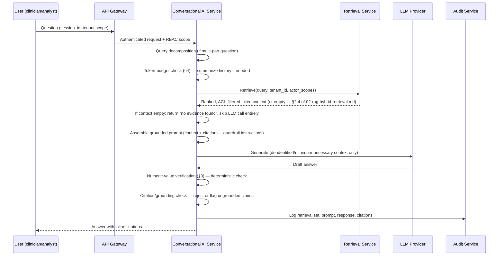

# Conversational AI Design

**Status:** Phase 0 — Design only
**Depends on:** [02-rag-hybrid-retrieval.md](02-rag-hybrid-retrieval.md), [06-security-compliance.md](06-security-compliance.md)
**Revised after Phase 0 review:** see [phase-0-architecture-review.md](../design/phase-0-architecture-review.md) findings B4, B10, B13, B16, A9.

## 1. Purpose

The Conversational AI Service is the chat/Q&A surface for clinicians, researchers, and analysts.
It is a thin orchestration layer over the Retrieval & Orchestration Service — it has **no
independent data access path** (see [ADR-0003](../design/adr-0003-multi-tenancy-model.md)),
which is the primary structural defense against a retriever surfacing another tenant's or
another user's out-of-scope data into a generated answer. Because this makes the Retrieval
Service the *only* access-control boundary this service relies on, Retrieval is explicitly named
a trusted-computing-base boundary and threat-modeled accordingly — see
[01-system-architecture.md §2](01-system-architecture.md#2-design-principles).

## 2. Request lifecycle

## 3. Grounding & citation enforcement

Every generated claim must trace to a retrieved chunk or graph entity/relationship. A
post-generation checker validates that the response's factual claims are supported by the
context actually provided (not the model's parametric knowledge) before the response is
returned; ungrounded or unsupported claims are either removed or the response is flagged for
human review rather than shown as confident fact. This is only possible in the first place
because of the no-evidence gate in
[02-rag-hybrid-retrieval.md §2.4](02-rag-hybrid-retrieval.md#24-no-evidence-gate-hallucination-prevention-structural) —
the grounding checker validates claims *against real context*, it does not substitute for having
context to check against.

**Numeric-value verification is a separate, deterministic step**, not folded into the general
grounding checker: any lab value, dosage, date, or other numeric clinical fact in the generated
response is exact-string/regex-matched against the literal value in its cited source (structured
table row or chunk text) before the response ships. A generic LLM-judge or NLI-style grounding
checker is known to be weak at catching a numerically-wrong-but-plausibly-phrased claim (context
says 5mg, model outputs 50mg) — this is a patient-safety failure mode, not a generic
ungrounded-claim case, and gets its own check for that reason
([review finding B10](../design/phase-0-architecture-review.md)). A numeric mismatch fails the
same way an ungrounded claim does: removed or flagged for review, never shown silently corrected.

**Citation traceability**: citations reference `document_id` + chunk offset (for vector/keyword
sourced claims, traceable via `document_chunks` in
[postgres-schema.sql](../database/postgres-schema.sql)) or a graph entity/relationship ID (for
graph-sourced claims). Graph-sourced citations resolve through the `source_document_id` and
`asserted_by` provenance properties now present on every clinically actionable edge — see
[graph-schema.md §0](../database/graph-schema.md#0-design-patterns-applied-throughout-this-schema)
— closing the earlier gap where graph-entity citations had no demonstrated traceable path
([review finding B13](../design/phase-0-architecture-review.md)). `chat_messages.citations_json`
entries are validated by the Conversational AI Service against real chunk/entity IDs at write
time, since JSONB has no native foreign-key enforcement
([review finding B14](../design/phase-0-architecture-review.md)); malformed or unresolvable
citation references are treated as a grounding failure, not silently stored.

## 4. Session & multi-turn state

Session state (conversation history, active patient/cohort context if any, prior retrieved
context) is stored server-side, scoped to `(tenant_id, user_id, session_id)`, with a
configurable TTL and explicit user-triggered deletion — session state containing PHI is subject
to the same retention and audit rules as any other PHI store (see
[06-security-compliance.md](06-security-compliance.md)).

**Context-window management** (previously unspecified —
[review finding B4](../design/phase-0-architecture-review.md)): each turn, the service tracks a
token budget split three ways — retrieved context, conversation history, and reserved generation
headroom. When accumulated `chat_messages` history would exceed the history budget, the oldest
turns beyond a fixed window (last 6 turns kept verbatim) are replaced with a rolling LLM-generated
summary of the dropped turns, **not silently truncated**. The summary is itself stored and shown
to the user as a visible "earlier in this conversation..." marker, and any clinically material
fact in a summarized turn (e.g., a stated contraindication or allergy) is cross-checked against
the active retrieval context on every subsequent turn rather than relying on the summary alone to
preserve it — silent loss of an earlier-stated contraindication is a patient-safety-relevant
failure mode, not just a UX one.

**Cross-session patient-context memory** (a clinician resuming context across sessions/days) is
explicitly a Phase 2+ enhancement, not a Phase 0/1 gap silently left open — `chat_sessions` is
scoped per-session by design for Phase 1, and cross-session memory requires its own retention/
consent design before it's added.

## 5. Guardrails

- **Input guardrails**: prompt-injection detection on retrieved document content (a document in
  the corpus should never be able to issue instructions to the model), PII/PHI scope validation
  against the requesting user's minimum-necessary access.
- **Output guardrails**: PHI redaction appropriate to the requesting user's role (e.g., a
  population-health analyst sees de-identified aggregates even if the underlying retrieval
  touched patient-level records), refusal behavior for out-of-scope requests (the platform
  answers from retrieved evidence — it does not provide open-ended medical advice divorced from
  the tenant's own corpus), and structured-output enforcement for any downstream-consumed
  response (e.g., a coding suggestion must return a valid ontology code, not free text).
- **Rate/cost guardrails**: per-tenant and per-user request quotas, enforced at the API Gateway
  (see [openapi.yaml](../api/openapi.yaml) `429` responses and rate-limit headers).
- **Emergency access ("break-glass")**: a clinician can request elevated, out-of-panel access to
  a patient record in an emergency via a dedicated endpoint
  (`POST /access/break-glass` — [openapi.yaml](../api/openapi.yaml)), which grants short-lived
  elevated scope and triggers mandatory heightened audit logging distinct from normal-path access
  logging — see [06-security-compliance.md §3](06-security-compliance.md#3-identity-authentication--authorization).

## 6. Not in scope for Phase 0/1

Autonomous multi-step clinical decision-making (the system answers questions and surfaces
evidence; it does not autonomously act on a patient record) and voice/ambient interfaces are
explicitly out of scope until the core grounded-QA experience is validated in production.
**Imaging-pixel analysis and genomics** (beyond DICOM study *metadata*, which is already an
ingestible document type per
[02-rag-hybrid-retrieval.md §1.1](02-rag-hybrid-retrieval.md#11-document-classification--layout-aware-parsing))
are likewise explicitly deferred, not silently absent — see the roadmap's Phase 9 modality
extension point ([implementation-roadmap.md](../roadmap/implementation-roadmap.md)) for how a
future image-embedding or genomic-variant-ontology modality would plug in without a redesign of
this document's grounding/citation model.

## 7. Related documents

- [RAG & Hybrid Retrieval Design](02-rag-hybrid-retrieval.md)
- [Security, Multi-Tenancy & Compliance](06-security-compliance.md)
- [API specification](../api/openapi.yaml)
- [Phase 0 Architecture Review](../design/phase-0-architecture-review.md)
