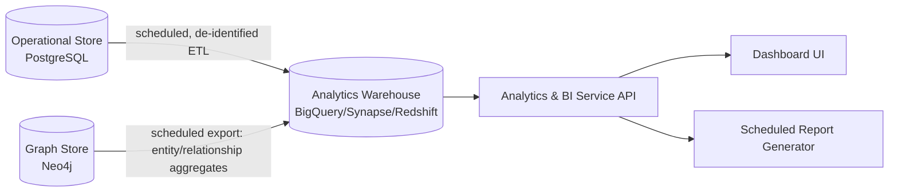

# Analytics & Dashboard Design

**Status:** Phase 0 — Design only
**Depends on:** [01-system-architecture.md](01-system-architecture.md), [06-security-compliance.md](06-security-compliance.md)

## 1. Purpose

The Analytics & BI Service serves population-level, cohort, and operational metrics — distinct
from the Conversational AI Service's per-question grounded answers. It answers questions like
"how many patients on Drug X reported Adverse Event Y this quarter" or "document ingestion
throughput and extraction accuracy by source system," backed by a dedicated analytics warehouse
rather than live transactional/graph queries, so dashboard load never contends with query-path
latency budgets ([02-rag-hybrid-retrieval.md §5](02-rag-hybrid-retrieval.md#5-latency--cost-budget-design-targets-to-be-validated-in-phase-1)).

## 2. Architecture

- **De-identified by default**: the ETL into the analytics warehouse applies the platform's
  de-identification pipeline (Safe Harbor or Expert Determination, per tenant configuration —
  see [06-security-compliance.md](06-security-compliance.md)) so ad hoc analytics queries do not
  require the same minimum-necessary access controls as patient-level retrieval; re-identified,
  patient-level analytics remain gated behind explicit elevated RBAC scope and are logged as
  PHI access events.
- **Separation from the query path**: the warehouse is refreshed on a schedule (near-real-time
  streaming is a documented future option, not a Phase 0/1 commitment), decoupling dashboard load
  from the low-latency conversational/search path.

## 3. Dashboard categories (Phase 1 scope)

| Category | Example metrics | Primary users |
|---|---|---|
| Clinical/pharmacovigilance | Adverse-event signal trends, drug-condition co-occurrence, cohort sizing | Pharmacovigilance analysts, medical affairs |
| Operational | Ingestion throughput, extraction/coding accuracy, retrieval latency percentiles, index freshness | Platform/data engineering |
| Governance | Access audit summaries, per-tenant PHI access reports, de-identification job status | Compliance/security officers |
| Usage | Query volume, top question categories, citation/grounding pass rate, user adoption by role | Product, customer success |

## 4. API surface

Read-only aggregate query API and scheduled-report API — see
[../api/openapi.yaml](../api/openapi.yaml) `/analytics/*` endpoints. No direct SQL/Cypher access
is exposed to end users; all queries go through parameterized, RBAC-scoped query templates to
prevent both injection and inadvertent PHI exposure via free-form query construction.

## 5. Related documents

- [Security, Multi-Tenancy & Compliance](06-security-compliance.md)
- [Database schema](../database/postgres-schema.sql)
- [API specification](../api/openapi.yaml)
