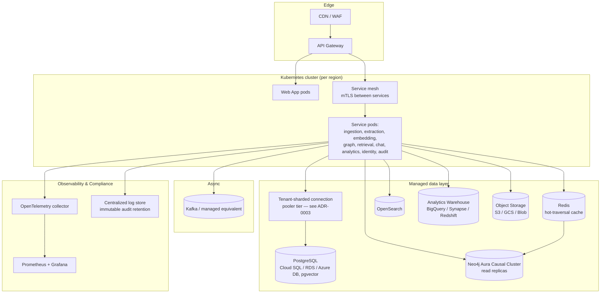

# Deployment Architecture

**Status:** Phase 0 — Design only
**Depends on:** [01-system-architecture.md](../architecture/01-system-architecture.md), [06-security-compliance.md](../architecture/06-security-compliance.md)
**Revised after Phase 0 review:** see [phase-0-architecture-review.md](../design/phase-0-architecture-review.md) findings A1, A5, A16, C18, D11, D12.

## 1. Deployment topologies

Three supported topologies, selected per-tenant at onboarding — driven by the data-residency and
BAA requirements documented in [06-security-compliance.md §7](../architecture/06-security-compliance.md#7-data-residency--deployment-options):

| Topology | When used | Notes |
|---|---|---|
| **Cloud-only (multi-tenant shared infra)** | Pharma/analytics-org tenants, smaller hospital systems without residency constraints | Lowest cost, fastest onboarding; isolation via [ADR-0003](../design/adr-0003-multi-tenancy-model.md) |
| **Cloud-only (dedicated tenant infra)** | Large hospital systems requiring physical infrastructure separation | Dedicated Kubernetes namespace/cluster, dedicated database instances, same codebase |
| **Hybrid / on-prem** | Hospital systems with sovereign-cloud or air-gapped requirements | Ingestion, graph store, and vector store deployed in the hospital's own data center or private cloud; only non-PHI control-plane traffic (deployment orchestration, license checks) reaches the vendor cloud; on-prem/open-weight embedding and LLM models required (no external API calls) |

**Identity in the hybrid/on-prem topology**: cloud IdP federation (Entra ID, Okta, Identity
Platform — §3 below) assumes a hospital has already migrated to a cloud directory, which is not
universal — many hospital IT estates still run on-prem Active Directory, ADFS, or plain LDAP. The
hybrid topology explicitly supports federating against on-prem AD/ADFS/LDAP directly (via a
locally-deployed Identity & Access Service instance performing Kerberos/LDAP bind auth, or ADFS
SAML federation without a cloud IdP intermediary), not only the cloud-IdP path — an earlier draft
of this document only addressed the cloud case
([review finding A16](../design/phase-0-architecture-review.md)).

## 2. Reference cloud architecture (multi-tenant topology)

**Connection pooling**: the `POOL` tier implements the tenant-sharded pooler design in
[ADR-0003](../design/adr-0003-multi-tenancy-model.md#consequences) — session-pooled shards keyed
by `tenant_id`, not a single transaction-pooled cluster, because schema-per-tenant mode cannot
safely rotate `search_path`/`app.tenant_id` per checkout under transaction pooling. This was
previously deferred as an unspecified "Phase 1 concern"
([review finding D12](../design/phase-0-architecture-review.md)); the strawman is now in ADR-0003,
with shard-count sizing to be finalized once Phase 1 measures real per-tenant connection counts.

**Graph store HA and caching**: Neo4j runs as a Causal Cluster with read replicas (not a single
instance) so read-heavy local-search traversal doesn't contend with write throughput, and a Redis
cache sits in front of the graph store for hot-path entity-neighborhood lookups — both were absent
from the original design ([review finding C18](../design/phase-0-architecture-review.md)) despite
the "real-time" latency claims in
[03-knowledge-graph.md §3](../architecture/03-knowledge-graph.md#3-local-vs-global-search)
depending on them.

## 3. Cloud provider mapping

Healthcare-specific, BAA-covered managed services are preferred over generic equivalents where
available, per provider:

| Concern | AWS | Azure | GCP |
|---|---|---|---|
| FHIR-native store (optional, for tenants wanting managed FHIR alongside our schema) | HealthLake | Health Data Services (broadest FHIR version coverage: DSTU2/STU3/R4/R4B) | Healthcare API |
| Medical NLP | Comprehend Medical | Health Data Services + Azure AI Language | Healthcare Natural Language API |
| Imaging | HealthImaging | DICOM service (part of Health Data Services) | Healthcare API DICOM store |
| Managed Postgres | RDS/Aurora PostgreSQL | Azure Database for PostgreSQL | Cloud SQL for PostgreSQL |
| Managed graph alternative | Neptune / Neptune Analytics | — (Neo4j Aura is cloud-agnostic) | — (Neo4j Aura is cloud-agnostic) |
| Identity federation | IAM Identity Center + tenant OIDC | Entra ID (common in hospital enterprise estates) | Identity Platform |
| Kubernetes | EKS | AKS | GKE |

Neo4j Aura is used as the default graph store regardless of cloud provider (per
[ADR-0002](../design/adr-0002-graph-database-choice.md)), keeping the platform cloud-portable;
provider-native graph services are documented alternatives for AWS-committed tenants only.

## 4. Environments & release process

| Environment | Purpose | Promotion |
|---|---|---|
| `dev` | Shared engineering environment, synthetic data only | Auto-deploy on merge to `development` |
| `staging` | Pre-prod validation, de-identified sample data | Manual promotion, gated on eval-suite pass ([02-rag-hybrid-retrieval.md §4](../architecture/02-rag-hybrid-retrieval.md#4-evaluation--observability)) |
| `prod` | Live tenant traffic | Manual promotion, requires compliance sign-off for any change touching PHI handling |

CI/CD: GitOps-based (e.g. ArgoCD/Flux), with policy gates blocking deployment of any change that
fails the HIPAA/SOC2-relevant control checklist (audit logging present, RLS policies unchanged
or reviewed, no new external network egress for PHI-bearing services without a corresponding
BAA record).

## 5. Observability & audit infrastructure

- **Tracing**: OpenTelemetry across all services, correlating a single user request through
  gateway → retrieval → generation, matching the tracing requirement in
  [02-rag-hybrid-retrieval.md §4](../architecture/02-rag-hybrid-retrieval.md#4-evaluation--observability).
- **Metrics**: Prometheus + Grafana for latency/throughput/error-rate dashboards against the
  budgets in [02-rag-hybrid-retrieval.md §5](../architecture/02-rag-hybrid-retrieval.md#5-latency--cost-budget-design-targets-to-be-validated-in-phase-1).
- **Audit log storage**: append-only, written to both `platform.audit_log` (Postgres, queryable
  via the Admin API) and a separate immutable/WORM-configured log store for long-term retention
  (default 6 years per [06-security-compliance.md §5](../architecture/06-security-compliance.md#5-audit-logging)),
  decoupling audit durability from the operational database's own backup/retention policy.
- **AI-agent containment**: pod-level network policy restricting any service capable of calling
  an external LLM API to an explicit, BAA-verified allowlist of destinations; killing such a pod
  is treated as a compliance-relevant event, not just an availability event, given its potential
  PHI-exfiltration blast radius.

## 6. Backup, disaster recovery & tenant lifecycle

RPO/RTO targets, backup cadence, incident-response process, and breach-notification workflow are
specified in [docs/operations/sla-dr.md](../operations/sla-dr.md) rather than here, to avoid two
copies of the same numbers drifting apart — this document owns *topology*, that one owns
*operational targets and process*. Tenant onboarding and offboarding (schema/database
provisioning, BAA execution, data export, verified deletion) is specified in
[docs/operations/tenant-lifecycle.md](../operations/tenant-lifecycle.md). Both were entirely
absent from the original Phase 0 document set
([review findings A1, A5](../design/phase-0-architecture-review.md)).

## 7. Related documents

- [System Architecture Overview](../architecture/01-system-architecture.md)
- [Security, Multi-Tenancy & Compliance](../architecture/06-security-compliance.md)
- [Implementation Roadmap](../roadmap/implementation-roadmap.md)
- [SLA, Disaster Recovery, Incident Response & Cost Model](../operations/sla-dr.md)
- [Tenant Lifecycle (Onboarding/Offboarding)](../operations/tenant-lifecycle.md)
- [Non-Functional Requirements](../nfr.md)
- [Phase 0 Architecture Review](../design/phase-0-architecture-review.md)
